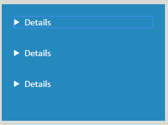

# HW1CodeRefactor

This Readme contains some of the changes made. I have been periodically pushing things to the repo, but the readme will contain more info. 

1. First thing is the obvious thing: title. The title was website. It is now named after this company.
2. The Second thing I did was remove extraneous divs. A lot of them had the semantic as the class. These were removed, and the CSS was adjusted accordingly. Some of them were in divs, but were not necessarily semantic , like the unordered list in the header not being a nav.
Content was swapped for article etc. One such example: 

    ```
   <div class="header">
        <h1>Hori<span class="seo">seo</span>n</h1>
    <div>
    ``` 
    
3. The CSS was cleaned up after realizing there were a lot of redundant of ids/classes. One example was the section where every chunk had a class like search-engine-optimization.. I consolidated these into one class/or ID and adjusted the CSS accordingly. I did some research, since I wanted to see if there was any correlation between less lines of CSS and a faster load time. I wanted to see if I could get the images to load faster using a technique called lazy loading. Since this required some JS, I felt it was beyond the scope of this homework assignment. 

4. The last thing I did was add alt text to all of the images. This was done with the help of an FOSS applet developed by the [Social Security agency](https://www.ssa.gov/accessibility/andi/help/install.html)

*Some interesting stuff*

* In an effort to add as many semantic tags as possible, I made the contents of the **benefits** sectiion  `detail` instead of `div`. It made a bunch of dropdowns. It led to this :
   
   
    
    **DetailQuirk** Behold the strangeness

*Additionally, I wanted to be cheeky and make all of the things linked in the `nav` a class to cut down clean up the CSS. While my stylesheet was smaller. The links no longer worked. I re-added the ids and _voila_! I was back in business. These are the small victories that make this work so fun (for me).


I ultmimately went through my code again and added comments in case someone does not like my readme.

:dog: